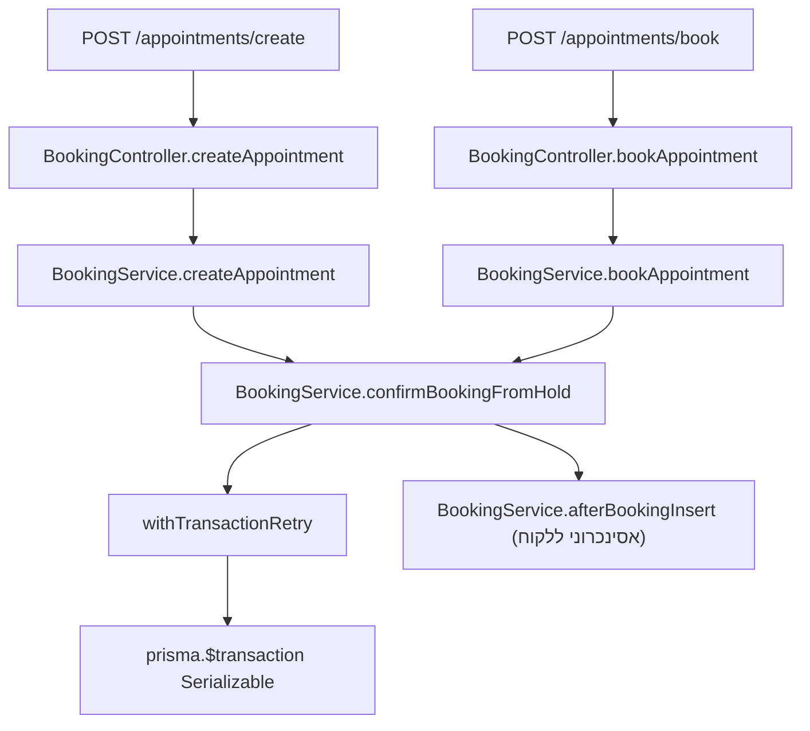

# Flow: `createAppointment` / אישור הזמנה מה-hold

בקוד הנוכחי, **"יצירת תור" סופית** מתבצעת דרך **`BookingService.confirmBookingFromHold`**. השם `createAppointment` הוא wrapper דק לשימוש אדמין; הלקוחות העוברים דרך `POST .../book` משתמשים ב־`bookAppointment` שמוסיף אכיפת `userId` על ה-hold.

## 1. כניסות HTTP

### א) אדמין / צוות — `createAppointment`

| פריט | ערך |
|------|-----|
| נתיב | `POST /appointments/create` |
| קובץ | `src/booking/booking.controller.ts` |
| קריאה | `this.booking.createAppointment(dto)` → `confirmBookingFromHold(dto)` **ללא** `requireHoldOwnerUserId` |

```96:103:barber-platform/backend/src/booking/booking.controller.ts
  @Post('appointments/create')
  @HttpCode(HttpStatus.CREATED)
  @Throttle({ default: { limit: 30, ttl: 60000 } })
  @Roles('owner', 'manager', 'staff')
  @Permissions('appointment:create')
  async createAppointment(@Body() dto: CreateAppointmentDto) {
    return this.booking.createAppointment(dto);
  }
```

### ב) לקוח / כולם — `bookAppointment`

| פריט | ערך |
|------|-----|
| נתיב | `POST /appointments/book` **או** `POST /book` |
| קובץ | `src/booking/booking.controller.ts` |
| קריאה | `bookAppointment(dto, requireHoldOwnerUserId)` כאשר ללקוח (`role === 'customer'`) מועבר `user.id` — רק בעל ה-hold יכול לאשר |

```231:242:barber-platform/backend/src/booking/booking.controller.ts
  @Post(['appointments/book', 'book'])
  @HttpCode(HttpStatus.CREATED)
  @Throttle(BOOK_THROTTLE)
  @Roles('owner', 'manager', 'staff', 'customer')
  @Permissions('appointment:create')
  async bookAppointment(
    @Body() dto: BookAppointmentDto,
    @CurrentUser() user: { id: string; role?: string },
  ) {
    const requireHoldOwnerUserId = user.role === 'customer' ? user.id : undefined;
    return this.booking.bookAppointment(dto, requireHoldOwnerUserId);
  }
```

## 2. שרשור קריאות



## 3. נתיבים נוספים (שירות בלבד)

- **`confirmFromWaitlistConversion`** — `createSlotHoldForSlotSelection` + `confirmBookingFromHold` עם `idempotencyKey: waitlist:...`  
  קובץ: `src/booking/booking.service.ts` (סביב שורות 339–358).

```typescript
  async confirmFromWaitlistConversion(dto: ConvertWaitlistDto, actorUserId: string) {
    const { hold } = await this.createSlotHoldForSlotSelection(
      {
        businessId: dto.businessId,
        staffId: dto.staffId,
        serviceId: dto.serviceId,
        customerId: dto.customerId,
        date: dto.date,
        startTime: dto.startTime,
        durationMinutes: dto.durationMinutes,
      },
      actorUserId,
    );
    return this.confirmBookingFromHold({
      businessId: dto.businessId,
      slotHoldId: hold.id,
      idempotencyKey: `waitlist:${dto.waitlistId}`,
      branchId: dto.branchId,
      locationId: dto.locationId,
    });
  }
```

## 4. `BookingService` — המימוש המלא של פלואו האישור

קובץ: `src/booking/booking.service.ts`. להלן **הקוד המדויק** של `createAppointment`, `bookAppointment`, `confirmBookingFromHold`, ו־`afterBookingInsert` כפי שמופיע במאגר (כולל טרנזקציה, retry, ו-side effects אחרי insert).

```typescript
  /**
   * Admin: finalize booking from a live hold (staff may confirm holds created for any user).
   */
  async createAppointment(dto: CreateAppointmentDto) {
    return this.confirmBookingFromHold(dto);
  }

  /**
   * Public book endpoint: same atomic confirm; optional `requireHoldOwnerUserId` enforces hold.userId (customers).
   */
  async bookAppointment(dto: BookAppointmentDto, requireHoldOwnerUserId?: string) {
    return this.confirmBookingFromHold(dto, { requireHoldOwnerUserId });
  }

  /**
   * Atomic: lock hold → validate → optional idempotency replay → insert appointment → mark hold consumed.
   * EXCLUDE on appointments still catches double-book race; mapped to {@link SLOT_ALREADY_TAKEN}.
   */
  async confirmBookingFromHold(
    dto: ConfirmBookingFromHoldDto,
    opts?: { requireHoldOwnerUserId?: string },
  ) {
    this.metrics.incrementBookingAttempt(dto.businessId);

    type Row = Prisma.AppointmentGetPayload<{ select: typeof BookingService.appointmentInsertSelect }>;

    let appointment: Row;
    try {
      appointment = await withTransactionRetry(
        () =>
          this.prisma.$transaction(
            async (tx) => {
        const now = utcNowJsDate();

        // 1) Idempotent replay: same business + key returns the original row (safe retries).
        if (dto.idempotencyKey) {
          const existing = await tx.appointment.findFirst({
            where: {
              businessId: dto.businessId,
              idempotencyKey: dto.idempotencyKey,
            },
            select: BookingService.appointmentInsertSelect,
          });
          if (existing) {
            return existing;
          }
        }

        // 2) Serialize on this hold so two confirms cannot consume it concurrently.
        // slot_holds.id is TEXT in DB (see migration), not uuid — cast must match.
        await tx.$queryRawUnsafe(
          'SELECT 1 FROM slot_holds WHERE id = $1::text FOR UPDATE',
          dto.slotHoldId,
        );

        const hold = await tx.slotHold.findUnique({ where: { id: dto.slotHoldId } });

        // 3) Hold must exist and belong to the intended tenant.
        if (!hold) {
          throw new NotFoundException({
            code: HOLD_NOT_FOUND,
            message: 'Slot hold not found.',
          });
        }
        if (hold.businessId !== dto.businessId) {
          throw new ForbiddenException({
            code: HOLD_BUSINESS_MISMATCH,
            message: 'Hold does not belong to this business.',
          });
        }

        // 4) Customer flow: only the user who placed the hold may confirm it.
        if (opts?.requireHoldOwnerUserId && hold.userId !== opts.requireHoldOwnerUserId) {
          throw new ForbiddenException({
            code: HOLD_FORBIDDEN,
            message: 'This hold was created by another user.',
          });
        }

        // 5) Single-use holds.
        if (hold.consumedAt != null) {
          throw new ConflictException({
            code: HOLD_ALREADY_USED,
            message: 'This slot hold was already used.',
          });
        }

        // 6) TTL
        if (hold.expiresAt <= now) {
          throw new BadRequestException({
            code: HOLD_EXPIRED,
            message: 'Slot hold has expired.',
          });
        }

        const bizTzRow = await tx.business.findUnique({
          where: { id: dto.businessId },
          select: { timezone: true },
        });
        const tz = ensureValidBusinessZone(resolveScheduleWallClockZone(bizTzRow?.timezone));
        const dateYmd = formatBusinessTime(hold.startTime, tz, 'yyyy-MM-dd');
        const startHhmm = formatBusinessTime(hold.startTime, tz, 'HH:mm');
        const slotKey = `${hold.businessId}:${hold.staffId}:${dateYmd}:${startHhmm}`;

        try {
          // 7) Persist appointment + FK to hold; DB EXCLUDE / unique constraints reject conflicts.
          // No availability engine or application-level overlap prediction on confirm.
          const created = await tx.appointment.create({
            data: {
              businessId: hold.businessId,
              branchId: dto.branchId ?? null,
              locationId: dto.locationId ?? null,
              customerId: hold.customerId,
              staffId: hold.staffId,
              serviceId: hold.serviceId,
              startTime: hold.startTime,
              endTime: hold.endTime,
              status: 'CONFIRMED',
              slotKey,
              notes: dto.notes ?? null,
              slotHoldId: hold.id,
              idempotencyKey: dto.idempotencyKey ?? null,
            },
            select: BookingService.appointmentInsertSelect,
          });

          // 8) Consume hold (`consumedAt`; row retained for FK / audit).
          await tx.slotHold.update({
            where: { id: hold.id },
            data: { consumedAt: now },
          });

          return created;
        } catch (e: unknown) {
          if (isTransientInsertFailure(e)) {
            throw e;
          }
          if (isPrismaUniqueViolation(e) && dto.idempotencyKey) {
            const replay = await tx.appointment.findFirst({
              where: {
                businessId: dto.businessId,
                idempotencyKey: dto.idempotencyKey,
              },
              select: BookingService.appointmentInsertSelect,
            });
            if (replay) {
              return replay;
            }
          }
          if (isPrismaUniqueViolation(e) || isPrismaExclusion23P01(e)) {
            this.metrics.incrementBookingConflict(dto.businessId);
            throw new ConflictException({
              code: BOOKING_SLOT_CONFLICT_CODE, // e.g. SLOT_ALREADY_BOOKED
              message: BOOKING_SLOT_CONFLICT_MESSAGE,
            });
          }
          const prisma = getPrismaErrorDiagnostics(e);
          this.logger.error('[Booking] confirmBookingFromHold failed', {
            code: prisma.prismaCode,
            slotHoldId: dto.slotHoldId,
            businessId: dto.businessId,
          });
          throw e;
        }
      },
            getBookingSerializableTxOptions(),
          ),
        this.logger,
        (attempt) => {
          this.logger.warn('[Booking] confirmBookingFromHold serialization retry', {
            attempt,
            slotHoldId: dto.slotHoldId,
            businessId: dto.businessId,
          });
        },
      );
    } catch (e: unknown) {
      if (isTransientInsertFailure(e) || isPrismaExclusion23P01(e)) {
        this.metrics.incrementBookingConflict(dto.businessId);
        const { prismaCode, errorChain } = getPrismaErrorDiagnostics(e);
        this.logger.warn('[Booking] confirmBookingFromHold → CONFLICT (serialization / exclusion)', {
          slotHoldId: dto.slotHoldId,
          businessId: dto.businessId,
          prismaCode,
          errorChain: errorChain.slice(0, 800),
        });
        throw new ConflictException({
          code: SLOT_ALREADY_TAKEN,
          message: 'Slot already booked.',
        });
      }
      throw e;
    }

    await this.afterBookingInsert(appointment as Row, appointment.id, appointment.startTime);
    return appointment;
  }

  private async afterBookingInsert(
    row: {
      businessId: string;
      customerId: string;
      staffId: string;
      startTime: Date;
    },
    appointmentId: string,
    startTimeUtc: Date,
  ): Promise<void> {
    const bizTzRow = await this.prisma.business.findUnique({
      where: { id: row.businessId },
      select: { timezone: true },
    });
    const tz = ensureValidBusinessZone(resolveScheduleWallClockZone(bizTzRow?.timezone));
    const dateYmd = formatBusinessTime(row.startTime, tz, 'yyyy-MM-dd');
    const startHhmm = formatBusinessTime(row.startTime, tz, 'HH:mm');

    this.notifications
      .notifyAppointmentBooked({
        businessId: row.businessId,
        customerId: row.customerId,
        appointmentId,
        customerName: 'Customer',
        serviceName: 'Appointment',
        date: dateYmd,
        startTime: startHhmm,
        phone: undefined,
        email: undefined,
      })
      .catch((e: unknown) => console.error('[Booking] notifyAppointmentBooked failed:', e));

    this.arrivalConfirmation
      .sendIfEnabled(appointmentId)
      .catch((e: unknown) => console.error('[Booking] arrivalConfirmation failed:', e));

    this.automation
      .scheduleAppointmentReminder(appointmentId, row.businessId, startTimeUtc)
      .catch((e: unknown) => console.error('[Booking] scheduleAppointmentReminder failed:', e));

    this.metrics.incrementBookingSuccess(row.businessId);
    this.bustAvailabilityCache(row.businessId, row.staffId, dateYmd.slice(0, 10));
  }
```

**הערות מקור:**

- `withTransactionRetry` מ־`src/common/transaction-retry.ts`
- `getBookingSerializableTxOptions` מ־`src/common/prisma-serializable-tx-options.ts`
- `BOOKING_SLOT_CONFLICT_CODE` / `BOOKING_SLOT_CONFLICT_MESSAGE` — `src/booking/booking-lock.errors.ts`
- קונסטנטות שגיאת hold — אותו קובץ

## 5. עוזרים משותפים (זהים ל-flow של hold)

ר' **`FLOW_CREATE_SLOT_HOLD.md`** — סעיפי `transaction-retry.ts` ו־`prisma-serializable-tx-options.ts` (העתקה מלאה שם).

---

*מקור האמת לשורות מדויקות: הקבצים תחת `barber-platform/backend/src/`.*
