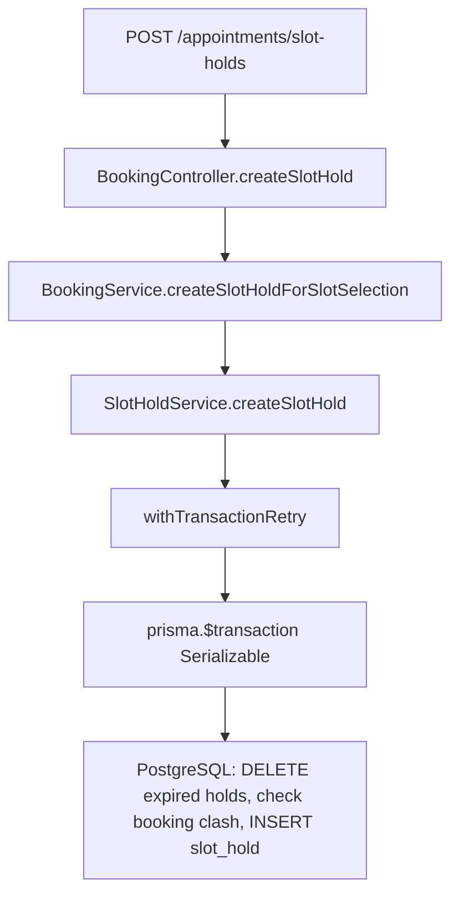

# Flow: `createSlotHold` (החזקת סלוט)

מסמך זה מתאר **בדיוק** איפה רץ תהליך יצירת ה-hold, מאיזה HTTP endpoint, דרך אילו שירותים, ועד לטרנזקציה ב-Prisma/PostgreSQL.

## 1. כניסת HTTP

| פריט | ערך |
|------|-----|
| שיטה + נתיב | `POST /appointments/slot-holds` |
| קובץ | `src/booking/booking.controller.ts` |
| Handler | `createSlotHold` → `this.booking.createSlotHoldForSlotSelection(dto, userId)` |
| סטטוס ברירת מחדל | `201 Created` (`@HttpCode`) |
| Guard / הרשאות | `JwtAuthGuard`, `RolesGuard`; תפקידים: owner, manager, staff, customer; `appointment:create` |

כיתוב בקוד (מקור):

```84:94:barber-platform/backend/src/booking/booking.controller.ts
  @Post('appointments/slot-holds')
  @HttpCode(HttpStatus.CREATED)
  @Throttle({ default: { limit: 60, ttl: 60000 } })
  @Roles('owner', 'manager', 'staff', 'customer')
  @Permissions('appointment:create')
  async createSlotHold(
    @Body() dto: CreateSlotHoldRequestDto,
    @CurrentUser('id') userId: string,
  ) {
    return this.booking.createSlotHoldForSlotSelection(dto, userId);
  }
```

## 2. שרשור קריאות (call chain)



**רישום DI:** `BookingModule` מייבא את `SchedulingV2Module`, שבו מוגדר `SlotHoldService`:

```17:26:barber-platform/backend/src/booking/booking.module.ts
@Module({
  imports: [
    SchedulingV2Module,
    AvailabilityModule,
    WaitlistModule,
    NotificationsModule,
    CustomerVisitsModule,
    forwardRef(() => AutomationModule),
  ],
  controllers: [BookingController],
```

## 3. `BookingService.createSlotHoldForSlotSelection` — מקור מלא

קובץ: `src/booking/booking.service.ts` (שורות 361–426 לפי גרסת המאגר).

הפונקציה: טעינת אזור זמן עסק, `parseBusinessWallSlotLocal`, **אימות מול מנוע הזמינות** (`assertSlotHoldOfferedByAvailabilityEngine`), המרה ל-UTC, ואז קריאה ל־`slotHolds.createSlotHold`.

```typescript
  async createSlotHoldForSlotSelection(dto: CreateSlotHoldRequestDto, userId: string) {
    const dateYmd = dto.date.slice(0, 10);
    const bizTzRow = await this.prisma.business.findUnique({
      where: { id: dto.businessId },
      select: { timezone: true },
    });
    const tz = ensureValidBusinessZone(resolveScheduleWallClockZone(bizTzRow?.timezone));

    let slotLocal;
    try {
      slotLocal = parseBusinessWallSlotLocal({
        calendarYmd: dateYmd,
        wallHhmm: dto.startTime,
        durationMinutes: dto.durationMinutes,
        timeZone: tz,
      });
    } catch (e) {
      if (e instanceof TimeEngineError) {
        throw new BadRequestException(e.message);
      }
      throw e;
    }

    const timezoneDebug = {
      localStartIso: slotLocal.localStart.toISO(),
      localEndIso: slotLocal.localEnd.toISO(),
      utcStartIso: slotLocal.localStart.toUTC().toISO(),
      utcEndIso: slotLocal.localEnd.toUTC().toISO(),
    };

    await this.computedAvailability.assertSlotHoldOfferedByAvailabilityEngine({
      businessId: dto.businessId,
      staffId: dto.staffId,
      serviceId: dto.serviceId,
      dateYmd,
      wallStartHhmm: slotLocal.wallHhmm,
      durationMinutesFromClient: dto.durationMinutes,
      slotStartMinLocal: slotLocal.slotStartMin,
      timezoneDebug,
    });

    if (this.config.get<string>('LOG_SLOT_HOLD_TIMEZONE_DEBUG') === '1') {
      this.logger.log(
        JSON.stringify({
          type: 'SLOT_HOLD_TIMEZONE_DEBUG',
          calendarYmd: dateYmd,
          slotStartMin: slotLocal.slotStartMin,
          slotEndMin: slotLocal.slotEndMin,
          ...timezoneDebug,
        }),
      );
    }

    const startTime = slotLocal.localStart.toUTC().toJSDate();
    const endTime = slotLocal.localEnd.toUTC().toJSDate();

    return this.slotHolds.createSlotHold({
      businessId: dto.businessId,
      staffId: dto.staffId,
      customerId: dto.customerId,
      serviceId: dto.serviceId,
      userId,
      startTime,
      endTime,
    });
  }
```

**היכן מוגדר הקלאס:** אותו קובץ, `BookingService` — מקבל `slotHolds: SlotHoldService` בקונסטרקטור (ייבוא מ־`../scheduling-v2/slot-hold.service`).

## 4. `SlotHoldService.createSlotHold` — קובץ מלא (מקור)

קובץ: `src/scheduling-v2/slot-hold.service.ts`.

```typescript
/**
 * Concurrency-safe slot holds: PostgreSQL EXCLUDE (GiST) on (staff_id, tstzrange)
 * guarantees no two rows for the same staff overlap in time.
 *
 * Expired rows must be deleted (or ignored only in app logic); cleanup runs at hold-creation
 * and can be scheduled via cron. Partial EXCLUDE on expires_at is unreliable as clock advances
 * without row updates — see migration comment.
 */

import {
  Injectable,
  ConflictException,
  BadRequestException,
  Logger,
} from '@nestjs/common';
import { DateTime } from 'luxon';
import { AppointmentStatus } from '@prisma/client';
import { PrismaService } from '../prisma/prisma.service';
import { withTransactionRetry } from '../common/transaction-retry';
import { getBookingSerializableTxOptions } from '../common/prisma-serializable-tx-options';
import {
  getPrismaErrorDiagnostics,
  isPrismaExclusion23P01,
  isTransientInsertFailure,
} from '../common/prisma-error-helpers';

/** API / client stable code when hold cannot be placed (booking or concurrent hold). */
export const SLOT_ALREADY_TAKEN = 'SLOT_ALREADY_TAKEN';

const DEFAULT_HOLD_TTL_SECONDS = 300;

export type CreateSlotHoldParams = {
  staffId: string;
  startTime: Date;
  endTime: Date;
  userId: string;
  /** Required so confirmBooking(holdId) can create Appointment without extra payload */
  businessId: string;
  customerId: string;
  serviceId: string;
  holdTtlSeconds?: number;
};

@Injectable()
export class SlotHoldService {
  private readonly logger = new Logger(SlotHoldService.name);

  constructor(private readonly prisma: PrismaService) {}

  /**
   * 1) Remove expired holds (frees exclusion index entries).
   * 2) Reject if interval hits an active booking.
   * 3) Insert hold; EXCLUDE constraint serializes with peers → overlap → SLOT_ALREADY_TAKEN.
   */
  async createSlotHold(params: CreateSlotHoldParams): Promise<{
    hold: {
      id: string;
      staffId: string;
      startTime: Date;
      endTime: Date;
      userId: string;
      expiresAt: Date;
    };
    expiresAt: Date;
  }> {
    if (params.startTime >= params.endTime) {
      throw new BadRequestException('startTime must be before endTime');
    }

    const ttl = params.holdTtlSeconds ?? DEFAULT_HOLD_TTL_SECONDS;
    const expiresAt = DateTime.utc().plus({ seconds: ttl }).toJSDate();

    try {
      return await withTransactionRetry(
        () =>
          this.prisma.$transaction(
            async (tx) => {
        const now = DateTime.utc().toJSDate();
        // Only drop expired holds with no appointment row (FK appointments_slot_hold_id_fkey RESTRICT).
        // Raw SQL: Prisma deleteMany + relation filter is unreliable for this 1:1 shape in some versions.
        await tx.$executeRaw`
          DELETE FROM "slot_holds" AS sh
          WHERE sh.expires_at <= ${now}
          AND NOT EXISTS (
            SELECT 1 FROM "appointments" AS a WHERE a."slotHoldId" = sh.id
          )
        `;

        const bookingClash = await tx.appointment.findFirst({
          where: {
            staffId: params.staffId,
            status: { notIn: [AppointmentStatus.CANCELLED, AppointmentStatus.NO_SHOW] },
            startTime: { lt: params.endTime },
            endTime: { gt: params.startTime },
          },
          select: { id: true },
        });
        if (bookingClash) {
          throw new ConflictException(SLOT_ALREADY_TAKEN);
        }

        try {
          const hold = await tx.slotHold.create({
            data: {
              businessId: params.businessId,
              staffId: params.staffId,
              customerId: params.customerId,
              serviceId: params.serviceId,
              startTime: params.startTime,
              endTime: params.endTime,
              userId: params.userId,
              expiresAt,
            },
          });
          return {
            hold: {
              id: hold.id,
              staffId: hold.staffId,
              startTime: hold.startTime,
              endTime: hold.endTime,
              userId: hold.userId,
              expiresAt: hold.expiresAt,
            },
            expiresAt: hold.expiresAt,
          };
        } catch (e: unknown) {
          if (isTransientInsertFailure(e)) {
            throw e;
          }
          if (isPrismaExclusion23P01(e)) {
            throw new ConflictException(SLOT_ALREADY_TAKEN);
          }
          throw e;
        }
      },
            getBookingSerializableTxOptions(),
          ),
        this.logger,
        (attempt) => {
          this.logger.warn('[SlotHold] createSlotHold serialization retry', {
            attempt,
            staffId: params.staffId,
            businessId: params.businessId,
          });
        },
      );
    } catch (e: unknown) {
      if (isTransientInsertFailure(e) || isPrismaExclusion23P01(e)) {
        const { prismaCode, errorChain } = getPrismaErrorDiagnostics(e);
        this.logger.warn('[SlotHold] createSlotHold → CONFLICT', {
          staffId: params.staffId,
          businessId: params.businessId,
          prismaCode,
          errorChain: errorChain.slice(0, 800),
        });
        throw new ConflictException(SLOT_ALREADY_TAKEN);
      }
      throw e;
    }
  }

}
```

## 5. עוזרים משותפים (מקור מלא)

### `src/common/transaction-retry.ts`

```typescript
import { Logger } from '@nestjs/common';
import { isTransientInsertFailure } from './prisma-error-helpers';

/** Serialization failures (deadlock / P2034 / PG 40001): bounded retries to clear transient contention. */
const MAX_RETRIES = 3;
const INITIAL_BACKOFF_MS = 50;

function isSerializationError(e: unknown): boolean {
  return isTransientInsertFailure(e);
}

/** Pool saturated / default maxWait too low — safe to retry with backoff. */
function isTransactionAcquireTimeout(e: unknown): boolean {
  const err = e as { code?: string; message?: string };
  if (err?.code === 'P2028') return true;
  return /Unable to start a transaction in the given time/i.test(err?.message ?? '');
}

function isRetryableTransactionError(e: unknown): boolean {
  return isSerializationError(e) || isTransactionAcquireTimeout(e);
}

function sleep(ms: number): Promise<void> {
  return new Promise((resolve) => setTimeout(resolve, ms));
}

function backoff(attempt: number): number {
  return INITIAL_BACKOFF_MS * Math.pow(2, attempt) + Math.random() * 50;
}

export type OnRetryCallback = (attempt: number) => void;

/**
 * Run a transaction with optional retry on serialization failure only.
 * Retries up to MAX_RETRIES on deadlock / serialization only.
 */
export async function withTransactionRetry<T>(
  runTransaction: () => Promise<T>,
  logger?: Logger,
  onRetry?: OnRetryCallback,
): Promise<T> {
  let lastError: unknown;
  for (let attempt = 0; attempt < MAX_RETRIES; attempt++) {
    try {
      return await runTransaction();
    } catch (e) {
      lastError = e;
      if (!isRetryableTransactionError(e) || attempt === MAX_RETRIES - 1) {
        if (isRetryableTransactionError(e) && attempt === MAX_RETRIES - 1) {
          logger?.warn(
            `[Transaction] Exhausted ${MAX_RETRIES} attempts (serialization / pool timeout); failing`,
            { error: (e as Error)?.message },
          );
        }
        throw e;
      }
      onRetry?.(attempt + 1);
      const delay = backoff(attempt);
      logger?.warn(
        `[Transaction] Serialization conflict (attempt ${attempt + 1}/${MAX_RETRIES}), retrying in ${delay}ms`,
        { error: (e as Error)?.message },
      );
      await sleep(delay);
    }
  }
  throw lastError;
}
```

### `src/common/prisma-serializable-tx-options.ts`

```typescript
import { Prisma } from '@prisma/client';

function parseMs(env: string | undefined, fallback: number): number {
  const n = parseInt(String(env ?? ''), 10);
  return Number.isFinite(n) && n >= 1000 ? n : fallback;
}

/** maxWait / timeout for any interactive $transaction (pool pressure under load). */
export function getBookingTxInteractionLimits(): { maxWait: number; timeout: number } {
  return {
    maxWait: parseMs(process.env.PRISMA_TX_MAX_WAIT_MS, 12_000),
    timeout: parseMs(process.env.PRISMA_TX_TIMEOUT_MS, 25_000),
  };
}

/**
 * Serializable booking writes — use with withTransactionRetry (P2034 / P2028).
 */
export function getBookingSerializableTxOptions(): {
  isolationLevel: Prisma.TransactionIsolationLevel;
  maxWait: number;
  timeout: number;
} {
  return {
    ...getBookingTxInteractionLimits(),
    isolationLevel: Prisma.TransactionIsolationLevel.Serializable,
  };
}

/** Single-row FOR UPDATE + short writes — lower latency than Serializable for POST /appointments/book. */
export function getBookingAtomicBookTxOptions(): {
  isolationLevel: Prisma.TransactionIsolationLevel;
  maxWait: number;
  timeout: number;
} {
  return {
    ...getBookingTxInteractionLimits(),
    isolationLevel: Prisma.TransactionIsolationLevel.ReadCommitted,
  };
}
```

## 6. נתיבים נוספים שקוראים לאותה לוגיקת hold

- `BookingService.confirmFromWaitlistConversion` — קורא ל־`createSlotHoldForSlotSelection` ואז ל־`confirmBookingFromHold` (לא HTTP ישיר במסמך זה; בדרך כלל מ-waitlist/controller אחר).

---

*העתקות הקוד לעיל שקופות לקבצים תחת `barber-platform/backend/src/`. אם הקוד בפועל שונה — מקור האמת הוא הקבצים במאגר.*
